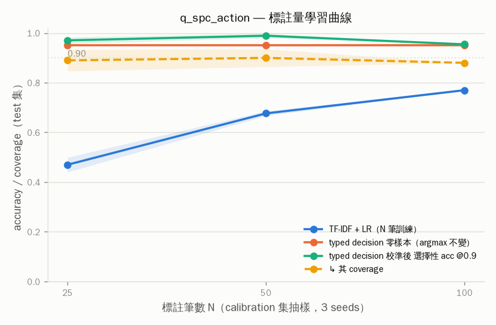
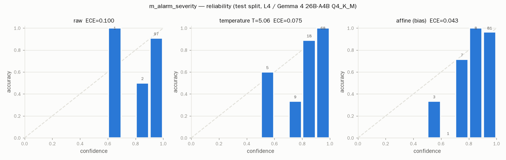
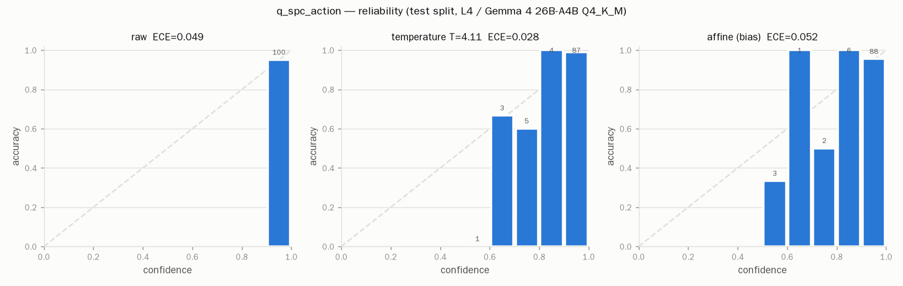

# 04 — 準確率與校準（M4/M5）

模型：Gemma 4 26B-A4B `UD-Q4_K_M`，llama-server，thinking 關閉，讀第一個 token 的選項字母 logprob。
資料：`data/synthetic/*.jsonl`（合成；見 MANIFEST）。切分：依 `pair_id` 分組 50/50 為 calibration / test，孿生例不跨集。
raw logprobs：`results/modal/accuracy/{task}.jsonl`。圖：`results/fig/`。原始數字：`results/analysis.json`。

## 1. 總表（test 集，raw = 未校準）

| task | kind | K | n | acc | macro-F1 | AUROC / top-2 | ECE raw | ECE T | ECE affine | sel@0.9 acc / cov | sel@0.95 acc / cov | missing | rules | TF-IDF+LR | JSON 生成 acc |
|---|---|---|---|---|---|---|---|---|---|---|---|---|---|---|---|
| m_alarm_severity | score | 3 | 100 | 0.900 | 0.890 | top2 1.000 | 0.100 | 0.075 | 0.043 | 0.907 / 0.97 | 0.906 / 0.96 | 0.19 | 0.590 | 0.810 | 0.860 |
| q_spc_action | choice | 4 | 100 | 0.950 | 0.952 | top2 0.960 | 0.049 | 0.028 | 0.052 | 0.950 / 1.00 | 0.950 / 1.00 | 0.46 | 0.470 | 0.770 | 0.910 |

## 2. 分項：難度與語言（全部資料，raw argmax）

| task | easy acc | hard acc | zh acc | en acc | hard: incomplete / borderline / noisy / distractor / inverted |
|---|---|---|---|---|---|
| m_alarm_severity | 0.921 | 0.800 | 0.912 | 0.780 | 0.83 / 0.67 / 0.67 / 1.00 / 0.83 |
| q_spc_action | 0.986 | 0.867 | 0.969 | 0.878 | 0.82 / 0.77 / 0.91 / 0.86 / 1.00 |

## 3. 校準能不能救（test 集）

| task | T | acc raw | acc affine | affine 改了多少 argmax | 修正的 raw 錯誤比例 | sel@0.9 raw acc/cov | sel@0.9 affine acc/cov | 判讀 |
|---|---|---|---|---|---|---|---|---|
| m_alarm_severity | 5.06 | 0.900 | 0.920 | 0.10 | 0.06 | 0.907/0.97 | 0.963/0.81 | 零樣本夠用 |
| q_spc_action | 4.11 | 0.950 | 0.930 | 0.05 | 0.00 | 0.950/1.00 | 0.955/0.88 | 零樣本夠用 |

## 4. 對照組：JSON 生成（`/v1/chat/completions`，temperature 0，每 task easy/hard 各 50）

| task | n | JSON acc | JSON easy | JSON hard | typed acc（同樣本） | JSON p50 ms | typed p50 ms（同樣本） | 無法解析 |
|---|---|---|---|---|---|---|---|---|
| m_alarm_severity | 100 | 0.860 | 0.920 | 0.800 | 0.840 | 2015 | 1462 | 0 |
| q_spc_action | 100 | 0.910 | 1.000 | 0.820 | 0.920 | 2959 | 1630 | 0 |

## 5. 基線

| task | 規則 all | 規則 easy | 規則 hard | TF-IDF+LR test | TF-IDF+LR hard | typed raw test | typed hard |
|---|---|---|---|---|---|---|---|
| m_alarm_severity | 0.665 | 0.664 | 0.667 | 0.810 | 0.393 | 0.900 | 0.800 |
| q_spc_action | 0.465 | 0.436 | 0.533 | 0.770 | 0.464 | 0.950 | 0.867 |

## 6. 標註量學習曲線（3 seeds；N 受限於 calibration 集大小 ≈100）

### q_spc_action

| N | TF-IDF+LR | typed 零樣本 | typed 校準後 acc | typed sel@0.9 acc | coverage | ECE |
|---|---|---|---|---|---|---|
| 25 | 0.470±0.03 | 0.950 | 0.923 | 0.971 | 0.89 | 0.048 |
| 50 | 0.677±0.01 | 0.950 | 0.937 | 0.989 | 0.90 | 0.045 |
| 100 | 0.770±0.00 | 0.950 | 0.930 | 0.955 | 0.88 | 0.052 |

## 7. 混淆矩陣（raw，全部資料；列 = gold，欄 = 預測）

**m_alarm_severity**

| gold \ pred | A | B | C |
|---|---|---|---|
| A 不急 | 53 | 15 | 0 |
| B 盡快 | 0 | 55 | 7 |
| C 停線 | 0 | 1 | 69 |

**q_spc_action**

| gold \ pred | A | B | C | D |
|---|---|---|---|---|
| A 持續監控 | 44 | 4 | 0 | 3 |
| B 抽檢 | 2 | 46 | 0 | 0 |
| C 停線複檢 | 0 | 0 | 52 | 1 |
| D 呼叫 QE | 0 | 0 | 0 | 48 |

## 8. Reliability diagrams

