# 04 — 準確率與校準（M4/M5）

模型：Gemma 4 26B-A4B `UD-Q4_K_M`，llama-server，thinking 關閉，讀第一個 token 的選項字母 logprob。
資料：`data/synthetic/*.jsonl`（合成；見 MANIFEST）。切分：依 `pair_id` 分組 50/50 為 calibration / test，孿生例不跨集。
raw logprobs：`results/modal/accuracy/{task}.jsonl`。圖：`results/fig/`。原始數字：`results/analysis.json`。

## 1. 總表（test 集，raw = 未校準）

| task | kind | K | n | acc | macro-F1 | AUROC / top-2 | ECE raw | ECE T | ECE affine | sel@0.9 acc / cov | sel@0.95 acc / cov | missing | rules | TF-IDF+LR | JSON 生成 acc |
|---|---|---|---|---|---|---|---|---|---|---|---|---|---|---|---|
| m_alarm_severity | score | 3 | 100 | 0.820 | 0.798 | top2 1.000 | 0.178 | 0.062 | 0.045 | 0.835 / 0.97 | 0.840 / 0.94 | 0.03 | 0.590 | 0.810 | 0.790 |
| m_alarm_category | choice | 5 | 100 | 0.980 | 0.980 | top2 1.000 | 0.015 | 0.015 | 0.016 | 0.990 / 0.99 | 0.990 / 0.99 | 0.73 | 0.750 | 0.850 | 0.970 |
| m_needs_dispatch | noul | 2 | 100 | 0.990 | 0.990 | 1.000 | 0.010 | 0.010 | 0.008 | 0.990 / 1.00 | 0.990 / 1.00 | 0.17 | 0.860 | 0.910 | 0.990 |
| q_spc_action | choice | 4 | 100 | 0.860 | 0.843 | top2 0.990 | 0.137 | 0.058 | 0.039 | 0.869 / 0.99 | 0.878 / 0.98 | 0.23 | 0.470 | 0.770 | 0.720 |
| q_defect_root | choice | 6 | 100 | 0.980 | 0.983 | top2 1.000 | 0.018 | 0.023 | 0.029 | 0.990 / 0.99 | 0.990 / 0.99 | 0.10 | 0.670 | 0.820 | 0.960 |
| p_uph_anomaly | noul | 2 | 100 | 0.930 | 0.929 | 0.991 | 0.073 | 0.046 | 0.035 | 0.929 / 0.99 | 0.939 / 0.98 | 0.06 | 0.740 | 0.750 | 0.880 |
| p_line_change | choice | 3 | 100 | 0.990 | 0.990 | top2 1.000 | 0.010 | 0.010 | 0.005 | 0.990 / 1.00 | 0.990 / 1.00 | 0.27 | 0.870 | 0.950 | 0.990 |
| x_ticket_route | choice | 4 | 100 | 1.000 | 1.000 | top2 1.000 | 0.003 | 0.010 | 0.004 | 1.000 / 0.99 | 1.000 / 0.99 | 0.59 | 0.670 | 0.840 | 0.980 |
| x_escalate | noul | 2 | 100 | 1.000 | 1.000 | 1.000 | 0.000 | 0.000 | 0.001 | 1.000 / 1.00 | 1.000 / 1.00 | 0.25 | 0.700 | 0.910 | 1.000 |
| x_10way_intent | choice | 10 | 101 | 1.000 | 1.000 | top2 1.000 | 0.001 | 0.032 | 0.002 | 1.000 / 1.00 | 1.000 / 1.00 | 0.88 | 0.644 | 0.743 | 0.960 |

## 2. 分項：難度與語言（全部資料，raw argmax）

| task | easy acc | hard acc | zh acc | en acc | hard: incomplete / borderline / noisy / distractor / inverted |
|---|---|---|---|---|---|
| m_alarm_severity | 0.836 | 0.750 | 0.836 | 0.707 | 0.67 / 0.58 / 0.67 / 0.92 / 0.92 |
| m_alarm_category | 1.000 | 0.917 | 0.987 | 0.927 | 0.92 / 0.92 / 1.00 / 0.75 / 1.00 |
| m_needs_dispatch | 1.000 | 0.983 | 0.994 | 1.000 | 1.00 / 0.92 / 1.00 / 1.00 / 1.00 |
| q_spc_action | 0.843 | 0.750 | 0.824 | 0.780 | 0.64 / 0.69 / 0.91 / 0.64 / 0.91 |
| q_defect_root | 0.986 | 0.967 | 0.994 | 0.927 | 1.00 / 0.92 / 1.00 / 1.00 / 0.92 |
| p_uph_anomaly | 0.971 | 0.800 | 0.919 | 0.925 | 0.71 / 0.83 / 1.00 / 0.67 / 0.80 |
| p_line_change | 0.979 | 1.000 | 1.000 | 0.925 | 1.00 / 1.00 / 1.00 / 1.00 / 1.00 |
| x_ticket_route | 1.000 | 0.967 | 0.988 | 1.000 | 1.00 / 1.00 / 0.92 / 0.92 / 1.00 |
| x_escalate | 1.000 | 1.000 | 1.000 | 1.000 | 1.00 / 1.00 / 1.00 / 1.00 / 1.00 |
| x_10way_intent | 0.979 | 0.983 | 0.975 | 1.000 | 1.00 / 1.00 / 1.00 / 0.92 / 1.00 |

## 3. 校準能不能救（test 集）

| task | T | acc raw | acc affine | affine 改了多少 argmax | 修正的 raw 錯誤比例 | sel@0.9 raw acc/cov | sel@0.9 affine acc/cov | 判讀 |
|---|---|---|---|---|---|---|---|---|
| m_alarm_severity | 6.23 | 0.820 | 0.900 | 0.14 | 0.11 | 0.835/0.97 | 1.000/0.40 | 排序能力好、門檻問題 → 校準可救 |
| m_alarm_category | 4.11 | 0.980 | 0.990 | 0.01 | 0.01 | 0.990/0.99 | 0.989/0.94 | 零樣本夠用 |
| m_needs_dispatch | 0.05 | 0.990 | 0.990 | 0.00 | 0.00 | 0.990/1.00 | 1.000/0.99 | 零樣本夠用 |
| q_spc_action | 5.81 | 0.860 | 0.920 | 0.18 | 0.11 | 0.869/0.99 | 0.965/0.86 | 排序能力好、門檻問題 → 校準可救 |
| q_defect_root | 2.53 | 0.980 | 0.950 | 0.05 | 0.00 | 0.990/0.99 | 0.989/0.95 | 零樣本夠用 |
| p_uph_anomaly | 6.02 | 0.930 | 0.950 | 0.08 | 0.05 | 0.929/0.99 | 0.967/0.92 | 零樣本夠用 |
| p_line_change | 3.11 | 0.990 | 1.000 | 0.01 | 0.01 | 0.990/1.00 | 1.000/0.99 | 零樣本夠用 |
| x_ticket_route | 2.71 | 1.000 | 1.000 | 0.00 | 0.00 | 1.000/0.99 | 1.000/0.99 | 零樣本夠用 |
| x_escalate | 0.05 | 1.000 | 1.000 | 0.00 | 0.00 | 1.000/1.00 | 1.000/1.00 | 零樣本夠用 |
| x_10way_intent | 3.45 | 1.000 | 1.000 | 0.00 | 0.00 | 1.000/1.00 | 1.000/1.00 | 零樣本夠用 |

## 4. 對照組：JSON 生成（`/v1/chat/completions`，temperature 0，每 task easy/hard 各 50）

| task | n | JSON acc | JSON easy | JSON hard | typed acc（同樣本） | JSON p50 ms | typed p50 ms（同樣本） | 無法解析 |
|---|---|---|---|---|---|---|---|---|
| m_alarm_severity | 100 | 0.790 | 0.860 | 0.720 | 0.760 | 1181 | 955 | 0 |
| m_alarm_category | 100 | 0.970 | 1.000 | 0.940 | 0.970 | 1413 | 929 | 0 |
| m_needs_dispatch | 100 | 0.990 | 0.980 | 1.000 | 1.000 | 995 | 650 | 0 |
| q_spc_action | 100 | 0.720 | 0.720 | 0.720 | 0.780 | 1282 | 871 | 0 |
| q_defect_root | 100 | 0.960 | 0.940 | 0.980 | 0.970 | 1381 | 978 | 0 |
| p_uph_anomaly | 100 | 0.880 | 0.960 | 0.800 | 0.900 | 1028 | 621 | 0 |
| p_line_change | 100 | 0.990 | 0.980 | 1.000 | 0.990 | 1132 | 697 | 0 |
| x_ticket_route | 100 | 0.980 | 1.000 | 0.960 | 0.980 | 1186 | 751 | 0 |
| x_escalate | 100 | 1.000 | 1.000 | 1.000 | 1.000 | 957 | 580 | 0 |
| x_10way_intent | 100 | 0.960 | 0.940 | 0.980 | 0.990 | 1357 | 956 | 0 |

## 5. 基線

| task | 規則 all | 規則 easy | 規則 hard | TF-IDF+LR test | TF-IDF+LR hard | typed raw test | typed hard |
|---|---|---|---|---|---|---|---|
| m_alarm_severity | 0.665 | 0.664 | 0.667 | 0.810 | 0.393 | 0.820 | 0.750 |
| m_alarm_category | 0.740 | 0.764 | 0.683 | 0.850 | 0.571 | 0.980 | 0.917 |
| m_needs_dispatch | 0.870 | 0.857 | 0.900 | 0.910 | 0.679 | 0.990 | 0.983 |
| q_spc_action | 0.465 | 0.436 | 0.533 | 0.770 | 0.464 | 0.860 | 0.750 |
| q_defect_root | 0.720 | 0.764 | 0.617 | 0.820 | 0.536 | 0.980 | 0.967 |
| p_uph_anomaly | 0.755 | 0.857 | 0.517 | 0.750 | 0.357 | 0.930 | 0.800 |
| p_line_change | 0.885 | 0.964 | 0.700 | 0.950 | 0.821 | 0.990 | 1.000 |
| x_ticket_route | 0.650 | 0.664 | 0.617 | 0.840 | 0.536 | 1.000 | 0.967 |
| x_escalate | 0.710 | 0.700 | 0.733 | 0.910 | 0.786 | 1.000 | 1.000 |
| x_10way_intent | 0.635 | 0.657 | 0.583 | 0.743 | 0.552 | 1.000 | 0.983 |

## 6. 標註量學習曲線（3 seeds；N 受限於 calibration 集大小 ≈100）

### m_alarm_category

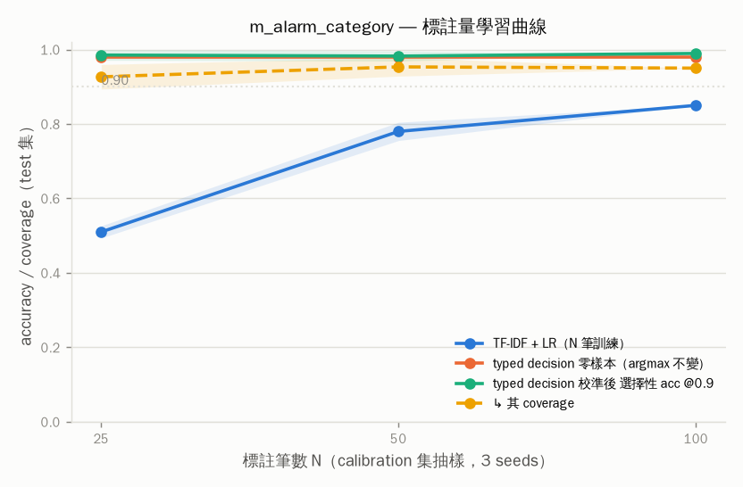

| N | TF-IDF+LR | typed 零樣本 | typed 校準後 acc | typed sel@0.9 acc | coverage | ECE |
|---|---|---|---|---|---|---|
| 25 | 0.510±0.02 | 0.980 | 0.963 | 0.985 | 0.93 | 0.037 |
| 50 | 0.780±0.02 | 0.980 | 0.970 | 0.982 | 0.95 | 0.026 |
| 100 | 0.850±0.00 | 0.980 | 0.990 | 0.989 | 0.95 | 0.014 |

### q_spc_action

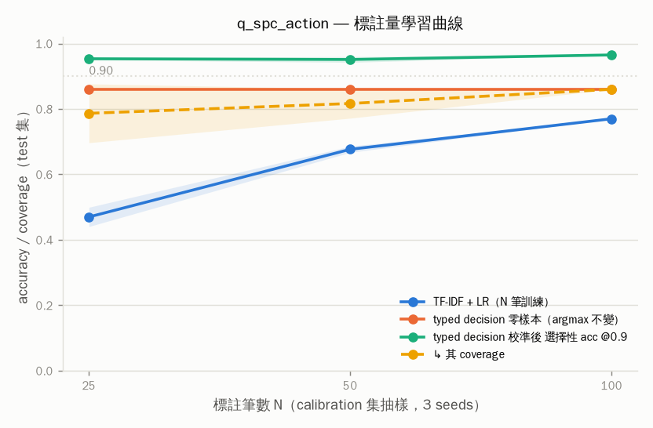

| N | TF-IDF+LR | typed 零樣本 | typed 校準後 acc | typed sel@0.9 acc | coverage | ECE |
|---|---|---|---|---|---|---|
| 25 | 0.470±0.03 | 0.860 | 0.883 | 0.953 | 0.79 | 0.057 |
| 50 | 0.677±0.01 | 0.860 | 0.917 | 0.951 | 0.82 | 0.062 |
| 100 | 0.770±0.00 | 0.860 | 0.920 | 0.965 | 0.86 | 0.038 |

### x_ticket_route

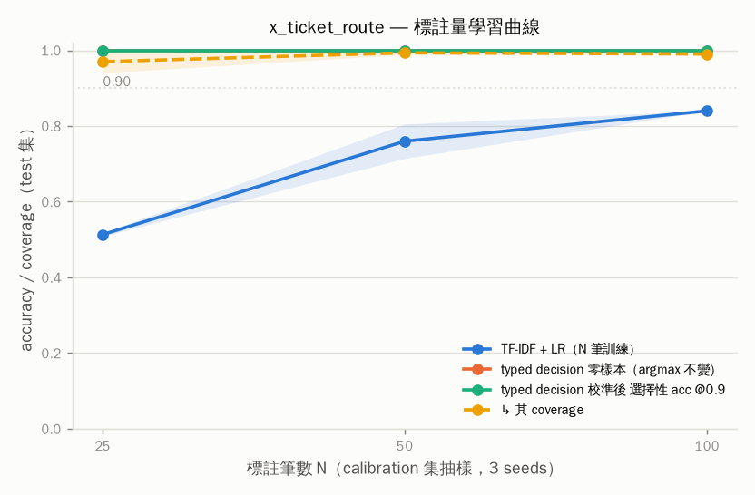

| N | TF-IDF+LR | typed 零樣本 | typed 校準後 acc | typed sel@0.9 acc | coverage | ECE |
|---|---|---|---|---|---|---|
| 25 | 0.513±0.00 | 1.000 | 0.983 | 1.000 | 0.97 | 0.021 |
| 50 | 0.760±0.05 | 1.000 | 0.997 | 1.000 | 0.99 | 0.008 |
| 100 | 0.840±0.00 | 1.000 | 1.000 | 1.000 | 0.99 | 0.004 |

## 7. 混淆矩陣（raw，全部資料；列 = gold，欄 = 預測）

**m_alarm_severity**

| gold \ pred | A | B | C |
|---|---|---|---|
| A 不急 | 59 | 9 | 0 |
| B 盡快 | 0 | 35 | 27 |
| C 停線 | 0 | 2 | 68 |

**m_alarm_category**

| gold \ pred | A | B | C | D | E |
|---|---|---|---|---|---|
| A 機構 | 40 | 0 | 1 | 0 | 1 |
| B 電控 | 0 | 40 | 0 | 0 | 1 |
| C 物料 | 0 | 0 | 40 | 0 | 0 |
| D 程式 | 0 | 0 | 2 | 38 | 0 |
| E 環境 | 0 | 0 | 0 | 0 | 37 |

**m_needs_dispatch**

| gold \ pred | A | B |
|---|---|---|
| A 是 | 100 | 0 |
| B 否 | 1 | 99 |

**q_spc_action**

| gold \ pred | A | B | C | D |
|---|---|---|---|---|
| A 持續監控 | 45 | 5 | 1 | 0 |
| B 抽檢 | 2 | 46 | 0 | 0 |
| C 停線複檢 | 0 | 0 | 53 | 0 |
| D 呼叫 QE | 0 | 1 | 28 | 19 |

**q_defect_root**

| gold \ pred | A | B | C | D | E | F |
|---|---|---|---|---|---|---|
| A 錫膏 | 35 | 0 | 0 | 0 | 0 | 0 |
| B 貼片 | 2 | 32 | 0 | 0 | 0 | 0 |
| C 回焊 | 0 | 1 | 33 | 0 | 0 | 0 |
| D 來料 | 0 | 0 | 0 | 34 | 0 | 0 |
| E 治具 | 0 | 0 | 0 | 0 | 32 | 0 |
| F 人為 | 1 | 0 | 0 | 0 | 0 | 30 |

**p_uph_anomaly**

| gold \ pred | A | B |
|---|---|---|
| A 是 | 99 | 1 |
| B 否 | 15 | 85 |

**p_line_change**

| gold \ pred | A | B | C |
|---|---|---|---|
| A 正常換線 | 67 | 0 | 0 |
| B 缺料等待 | 3 | 63 | 0 |
| C 設備待修 | 0 | 0 | 67 |

**x_ticket_route**

| gold \ pred | A | B | C | D |
|---|---|---|---|---|
| A 產線 | 50 | 0 | 1 | 0 |
| B 設備 | 0 | 52 | 0 | 0 |
| C IT | 1 | 0 | 49 | 0 |
| D 品保 | 0 | 0 | 0 | 47 |

**x_escalate**

| gold \ pred | A | B |
|---|---|---|
| A 是 | 100 | 0 |
| B 否 | 0 | 100 |

**x_10way_intent**

| gold \ pred | A | B | C | D | E | F | G | H | I | J |
|---|---|---|---|---|---|---|---|---|---|---|
| A 查詢工單進度 | 20 | 0 | 0 | 0 | 0 | 0 | 0 | 0 | 0 | 0 |
| B 查詢機台狀態 | 3 | 17 | 0 | 0 | 0 | 0 | 0 | 0 | 0 | 0 |
| C 回報機台異常 | 0 | 0 | 21 | 0 | 0 | 0 | 0 | 0 | 0 | 0 |
| D 回報品質異常 | 0 | 0 | 0 | 19 | 0 | 0 | 0 | 0 | 0 | 0 |
| E 申請物料 | 0 | 0 | 0 | 0 | 21 | 0 | 0 | 0 | 0 | 0 |
| F 申請維修 | 0 | 0 | 1 | 0 | 0 | 20 | 0 | 0 | 0 | 0 |
| G 申請換線 | 0 | 0 | 0 | 0 | 0 | 0 | 19 | 0 | 0 | 0 |
| H 申請權限或帳號 | 0 | 0 | 0 | 0 | 0 | 0 | 0 | 19 | 0 | 0 |
| I 詢問 SOP 或參數 | 0 | 0 | 0 | 0 | 0 | 0 | 0 | 0 | 20 | 0 |
| J 回報完工 | 0 | 0 | 0 | 0 | 0 | 0 | 0 | 0 | 0 | 20 |

## 8. Reliability diagrams

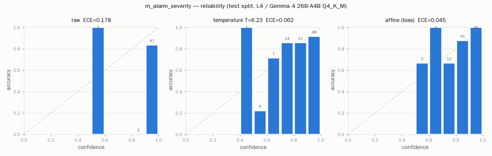
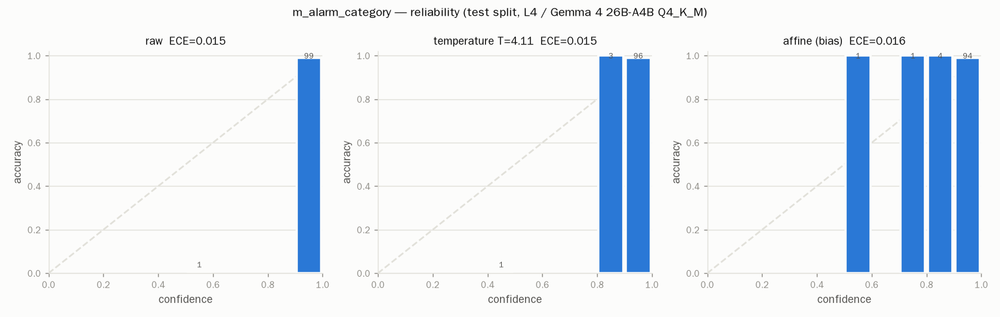
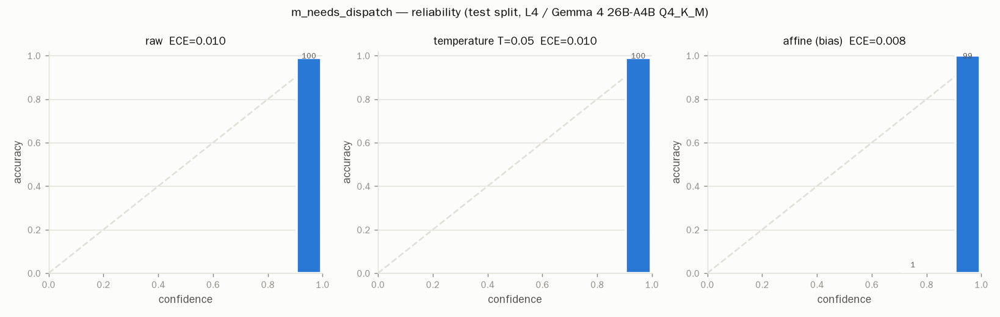
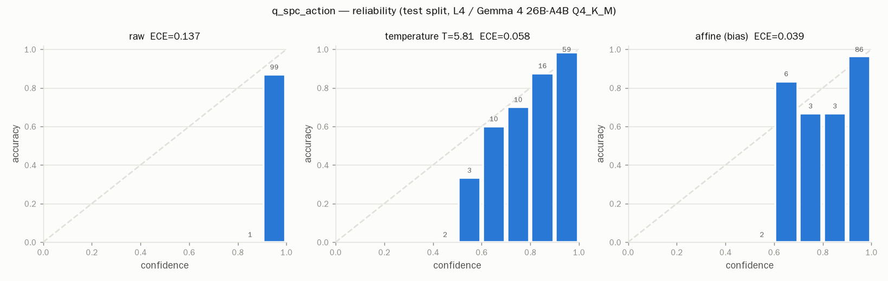
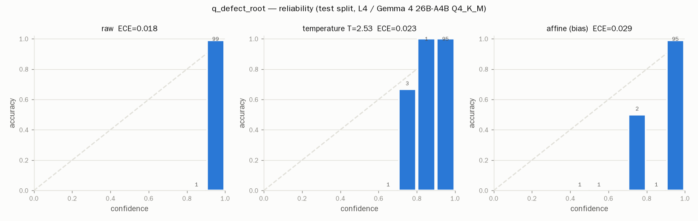
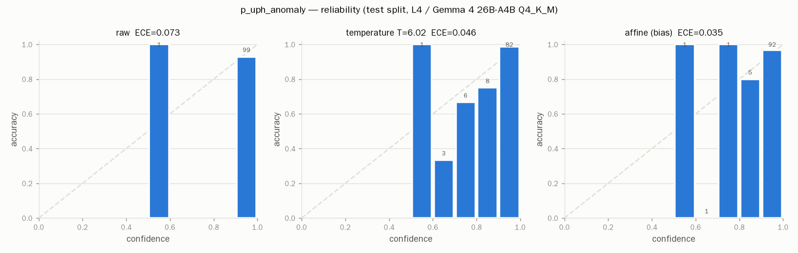
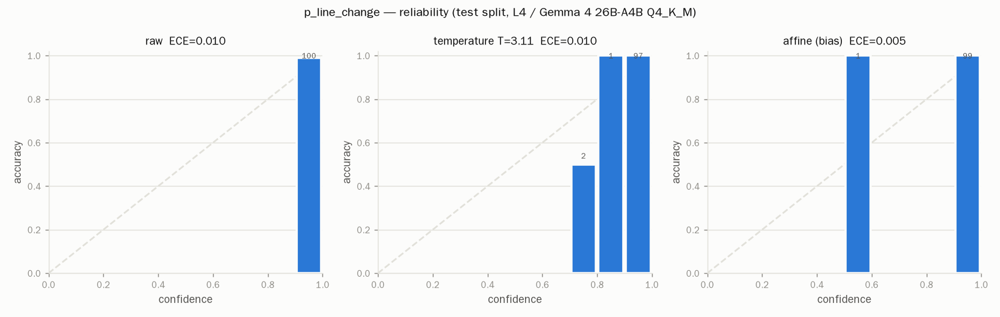
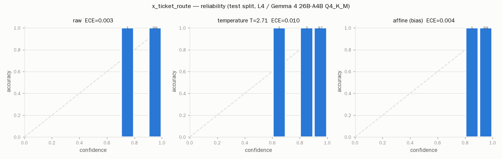
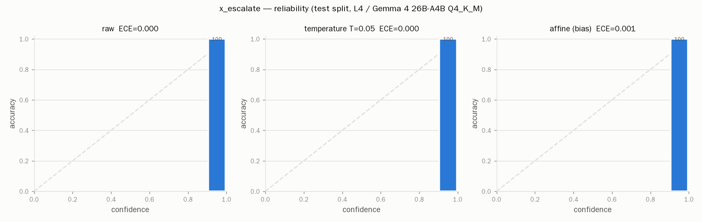
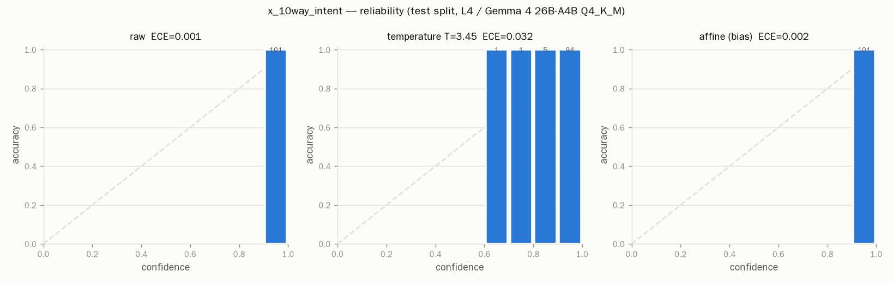
