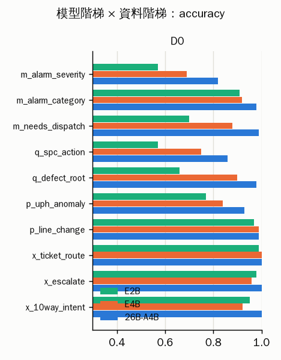

# 06 — 題目問題還是模型能力問題？（E2B / E4B / 26B × D0 / D1 / D2）

判讀規則預先登記於 `06-ladder-prereg.md`。所有比較都在同一批題目、同一個 prompt、`--swa-full` 下進行；D0 只算 test 集（依 pair_id 分組切半，seed 0），D1 是 D0 test 集的擾動版，D2 是 Gemini 盲寫、雙標註一致的題。原始：`results/ladder.json`。

## 1. 每個 task 的判定

| task | D0：E4B vs 26B | D1-cue | D2 | E2B@D0 | 判定 |
|---|---|---|---|---|---|
| m_alarm_severity | 明顯掉 | — | — | 0.570 | **H2：現有難度已能分出等級** |
| m_alarm_category | 明顯掉 | — | — | 0.910 | **H2：現有難度已能分出等級** |
| m_needs_dispatch | 明顯掉 | — | — | 0.700 | **H2：現有難度已能分出等級** |
| q_spc_action | 明顯掉 | — | — | 0.570 | **H2：現有難度已能分出等級** |
| q_defect_root | 明顯掉 | — | — | 0.660 | **H2：現有難度已能分出等級** |
| p_uph_anomaly | 明顯掉 | — | — | 0.770 | **H2：現有難度已能分出等級** |
| p_line_change | 相當 | — | — | 0.970 | **H1（E2B 在 D0 已 ≥ 0.95）** |
| x_ticket_route | 相當 | — | — | 0.990 | **H1（E2B 在 D0 已 ≥ 0.95）** |
| x_escalate | 介於 | — | — | 0.980 | **H1（E2B 在 D0 已 ≥ 0.95）** |
| x_10way_intent | 明顯掉 | — | — | 0.950 | **H1（E2B 在 D0 已 ≥ 0.95）** |

## 2. 主表：accuracy（95% bootstrap CI）

### D0

| task | n | E2B | E4B | 26B | 26B−E4B | McNemar p（E4B vs 26B） | E4B錯/26B對 | E4B對/26B錯 | hard: E4B / 26B |
|---|---|---|---|---|---|---|---|---|---|
| m_alarm_severity | 100 | 0.570 [0.47–0.67] | 0.690 [0.60–0.78] | 0.820 [0.74–0.89] | 0.130 | 0.007 | 17 | 4 | 0.679 / 0.857 |
| m_alarm_category | 100 | 0.910 [0.85–0.96] | 0.920 [0.86–0.97] | 0.980 [0.95–1.00] | 0.060 | 0.031 | 6 | 0 | 0.750 / 0.929 |
| m_needs_dispatch | 100 | 0.700 [0.61–0.78] | 0.880 [0.82–0.94] | 0.990 [0.97–1.00] | 0.110 | 0.001 | 11 | 0 | 0.786 / 0.964 |
| q_spc_action | 100 | 0.570 [0.47–0.67] | 0.750 [0.66–0.84] | 0.860 [0.79–0.92] | 0.110 | 0.007 | 13 | 2 | 0.679 / 0.857 |
| q_defect_root | 100 | 0.660 [0.57–0.75] | 0.900 [0.84–0.95] | 0.980 [0.95–1.00] | 0.080 | 0.008 | 8 | 0 | 0.821 / 1.000 |
| p_uph_anomaly | 100 | 0.770 [0.69–0.85] | 0.840 [0.76–0.91] | 0.930 [0.88–0.98] | 0.090 | 0.012 | 10 | 1 | 0.714 / 0.857 |
| p_line_change | 100 | 0.970 [0.93–1.00] | 0.990 [0.97–1.00] | 0.990 [0.97–1.00] | 0.000 | 1.000 | 1 | 1 | 1.000 / 1.000 |
| x_ticket_route | 100 | 0.990 [0.97–1.00] | 1.000 [1.00–1.00] | 1.000 [1.00–1.00] | 0.000 | 1.000 | 0 | 0 | 1.000 / 1.000 |
| x_escalate | 100 | 0.980 [0.95–1.00] | 0.960 [0.92–0.99] | 1.000 [1.00–1.00] | 0.040 | 0.125 | 4 | 0 | 1.000 / 1.000 |
| x_10way_intent | 101 | 0.950 [0.90–0.99] | 0.921 [0.86–0.97] | 1.000 [1.00–1.00] | 0.079 | 0.008 | 8 | 0 | 1.000 / 1.000 |

## 3. 錯誤偵測 AUROC（raw confidence 預測「這題會不會對」；0.5 = 信心與對錯無關）

| task | D0 E2B/E4B/26B | D1-typo E2B/E4B/26B | D1-cue E2B/E4B/26B | D1-cue≥1 E2B/E4B/26B | D1-mix E2B/E4B/26B | D2 E2B/E4B/26B |
|---|---|---|---|---|---|---|
| m_alarm_severity | 0.64 / 0.65 / 0.70 | — / — / — | — / — / — | — / — / — | — / — / — | — / — / — |
| m_alarm_category | 0.76 / 0.88 / 0.97 | — / — / — | — / — / — | — / — / — | — / — / — | — / — / — |
| m_needs_dispatch | 0.92 / 0.90 / 1.00 | — / — / — | — / — / — | — / — / — | — / — / — | — / — / — |
| q_spc_action | 0.79 / 0.90 / 0.89 | — / — / — | — / — / — | — / — / — | — / — / — | — / — / — |
| q_defect_root | 0.84 / 0.89 / 1.00 | — / — / — | — / — / — | — / — / — | — / — / — | — / — / — |
| p_uph_anomaly | 0.75 / 0.83 / 0.94 | — / — / — | — / — / — | — / — / — | — / — / — | — / — / — |
| p_line_change | 1.00 / 0.98 / 0.99 | — / — / — | — / — / — | — / — / — | — / — / — | — / — / — |
| x_ticket_route | 0.56 / — / — | — / — / — | — / — / — | — / — / — | — / — / — | — / — / — |
| x_escalate | 0.88 / 0.99 / — | — / — / — | — / — / — | — / — / — | — / — / — | — / — / — |
| x_10way_intent | 0.86 / 0.95 / — | — / — / — | — / — / — | — / — / — | — / — / — | — / — / — |

## 4. 26B 在「E4B 錯、26B 對」題目上的信心

| task | 資料集 | n | 中位數 conf | ≥0.99 的比例 |
|---|---|---|---|---|
| m_alarm_severity | D0 | 17 | 1.000 | 0.82 |
| m_alarm_category | D0 | 6 | 1.000 | 1.00 |
| m_needs_dispatch | D0 | 11 | 1.000 | 1.00 |
| q_spc_action | D0 | 13 | 1.000 | 1.00 |
| q_defect_root | D0 | 8 | 1.000 | 0.88 |
| p_uph_anomaly | D0 | 10 | 1.000 | 0.90 |
| p_line_change | D0 | 1 | 1.000 | 1.00 |
| x_escalate | D0 | 4 | 1.000 | 1.00 |
| x_10way_intent | D0 | 8 | 1.000 | 0.75 |

