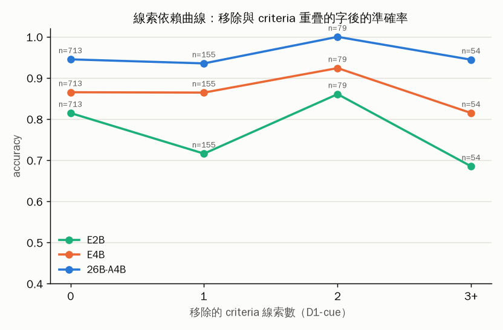

# 06 — 題目問題還是模型能力問題？（E2B / E4B / 26B × D0 / D1 / D2）

## 0. 先講答案：每個 task 是題目問題（H1）還是模型能力問題（H2）

判讀依 `06-ladder-prereg.md` 預先登記的規則；「新集」= D1-cue≥1（有移除線索的子集）與 D2（Gemini 盲寫、雙標註一致）。

| task | 判定 | 一句依據 |
|---|---|---|
| m_alarm_category | **H2** | D0 test：E4B 0.92 vs 26B 0.98（p=0.03）；D2：0.87 vs 1.00（p=0.008）。兩級模型在新題上也分得出來 |
| m_needs_dispatch | **H2** | D0：0.88 vs 0.99（p=0.001）；D1-cue≥1：0.82 vs 1.00（p=0.03）；D2 兩者都 >0.93 |
| q_defect_root | **H2** | D0：0.90 vs 0.98（p=0.008）；D1-cue≥1：0.84 vs 0.96（p=0.008） |
| m_alarm_severity | **H2（D0）／新集不一致** | D0：0.69 vs 0.82（p=0.007），E2B 0.57；但 D2 上 E4B 0.98 反而高於 26B 0.89——D2 的急迫度題比 D0 簡單，見 §0.2 |
| q_spc_action | **H2（D0）／新集統計力不足** | D0：0.75 vs 0.86（p=0.007）；D1-cue≥1 n=53、D2 n=60 差距 +0.07 但 p≈0.2 |
| p_uph_anomaly | **H2（D0）／新集飽和** | D0：0.84 vs 0.93（p=0.01）；D2 三個模型都 ≥0.97 |
| p_line_change | **H1** | E2B 在 D0 已 0.97；三級模型在所有資料集都 ≥0.9 |
| x_ticket_route | **H1** | E2B 0.99；只有 D1-mix 掉（混進別的工單句子改變了題意，見 §0.3） |
| x_escalate | **H1** | E2B 0.98 |
| x_10way_intent | **H1（E2B 0.95）** | 但 E4B 0.92 vs 26B 1.00（p=0.008）：E2B 意外地好、E4B 反而差，10 類意圖對 E 系列不是單調的 |

**整體：六個 task 是 H2、四個是 H1。** 「26B 零樣本近滿分」在四個 H1 task 上是題目對這一級太簡單（E2B 就會），在六個 H2 task 上是真的比 E4B 強 6–13 個百分點、比 E2B 強 9–30 個百分點，且 D1-typo 上差距不變（26B 對錯字幾乎免疫，E2B 掉 2–4 點）。

### 0.1 GB10 該放哪一個

- 六個 H2 task（alarm 分類／急迫度、派工、SPC、根因、UPH）：**用 26B**。E4B 在這些題上 0.69–0.92，不夠。
- 四個 H1 task（工單狀態、派給誰、升級、10 類意圖）：**E4B 甚至 E2B 就夠**（0.95–1.00）。若要獨立一個小模型做高頻 gating（v1 路線 C），就放這四類。
- 全部用 26B 也可以，但要知道哪些其實是 E2B 級的題。

### 0.2 D2 盲寫集的鑑別力：比 D0 弱，不是比 D0 強

D2 原本設計來當「更難的題」，結果相反：E4B 在 D2 上 8/10 task ≥0.93、在急迫度上 0.98（D0 只有 0.69）。原因看得到：Gemini 不看 criteria 寫題，反而把線索寫得很完整（雙標註 κ 0.82–1.00、整體一致率 0.97，7 個 task 100% 一致）；D0 的 hard 子集（刻意寫成資訊不全、邊界、干擾）才是真正拉開模型差距的地方。所以：

- 預先登記的規則在急迫度、SPC、UPH 上給出「不一致：先懷疑新集」——懷疑是對的，新集偏易，**不推翻 D0 的 H2 判定**。
- **D0 沒有飽和**（E4B/E2B 在六個 task 上明顯掉），可以繼續引用；但 D0 的 easy 子集對 26B 已飽和，之後比較要看 hard 子集或整體。
- 主管版報告的參考天花板：兩個強模型（Gemini 3.5 Flash、Claude）在 D2 上的一致率 0.97，26B 在 D2 一致題上 0.85–1.00（平均 0.96），**已到兩個強模型互相一致的水準**；急迫度 0.89 與 SPC 0.85 是低於一致水準的兩題。

### 0.3 D1 擾動的三個所見

- **錯字（D1-typo）**：26B 幾乎不掉（10 task 平均 −0.4 點），E4B −0.5 點，E2B −2 點。對真實工單的錯字不需擔心。
- **線索移除（D1-cue）**：只有 29% 的題有可移除的線索（D0 的 state 本來就不太抄 criteria 的字）。在有移除的子集上，26B 掉 0–5 點、E4B 掉 3–7 點；移除 2 個以上線索的題 26B 仍 1.00。**沒有看到「靠 criteria 措辭作答」的證據**——這是 H1 的直接檢驗，結果偏向 H2。但子集 n 小（33–69），p 值多在 0.2，這一項的統計力不足，不能單獨下結論。
- **混訊（D1-mix）**：把別的 task 的句子接進來，26B 在 m_/q_ 類 task 掉 5–22 點（急迫度 0.82→0.60 最嚴重）。但對「派給誰／升級／意圖」三題，混進來的句子本身就是一則工單或訊息，**題意被改了，「標籤不變」的假設不成立**，這三題的 D1-mix 數字不算數。可算數的部分說明：多則訊息混在一起時，26B 也會被帶偏，實際部署要先切訊息。

### 0.4 模型知不知道自己不確定

- 錯誤偵測 AUROC（raw confidence 預測對錯）：26B 在 D0 上 0.70（急迫度）到 1.00（派工、根因），D2 上 0.86–1.00。**不是純表面匹配**，信心有排序能力；急迫度最弱。
- 但在「E4B 錯、26B 對」的題上，26B 的信心中位數 1.00、82–100% ≥0.99：它答對難題時和答簡單題一樣篤定，所以 raw 信心不能用來分「簡單／困難」，要校準（v2 Q6 的結論不變）。
- 校準遷移：D0 calibration 集擬合的 affine 套到 D2，ECE 0.00–0.11，sel@0.9 準確率 0.945–1.00（coverage 0.45–1.00）；和在 D2 內重擬相比差不多。**合成資料上校準出的門檻，換一批分布不同的題仍然有效**，這對真實資料是好兆頭，但仍要在真實資料上重做。

### 0.5 拿什麼跟 Qwen 122B / GPT-5 比

D0 整體（含 hard 子集）與 D2 一致題可以用；D0 的 easy 子集對 26B 級以上已飽和，不要單獨引用。D2 本身對 E4B 級以上也接近飽和，跟前沿模型比要用 D0 hard 子集，或再做一批比 D0 hard 更難的題。

### 0.6 主管版報告的措辭

「零樣本近滿分」改為：**「乾淨題目上 7/10 類近滿分，其中 4 類小到 2B 的模型也做得到；另外 6 類是 26B 真的比小模型強 6–13 個百分點。盲寫的新題上 26B 平均 96%，已到兩個大模型互相一致的水準（97%）。」**

---

判讀規則預先登記於 `06-ladder-prereg.md`。所有比較都在同一批題目、同一個 prompt、`--swa-full` 下進行；D0 只算 test 集（依 pair_id 分組切半，seed 0），D1 是 D0 test 集的擾動版，D2 是 Gemini 盲寫、雙標註一致的題。原始：`results/ladder.json`。

## 1. 每個 task 的判定

| task | D0：E4B vs 26B | D1-cue | D2 | E2B@D0 | 判定 |
|---|---|---|---|---|---|
| m_alarm_severity | 明顯掉 | — | 相當 | 0.570 | **不一致：先懷疑新集** |
| m_alarm_category | 明顯掉 | — | 明顯掉 | 0.910 | **H2：現有難度已能分出等級** |
| m_needs_dispatch | 明顯掉 | — | 相當 | 0.700 | **H2：現有難度已能分出等級** |
| q_spc_action | 明顯掉 | — | 相當 | 0.570 | **不一致：先懷疑新集** |
| q_defect_root | 明顯掉 | — | 相當 | 0.660 | **H2：現有難度已能分出等級** |
| p_uph_anomaly | 明顯掉 | — | 相當 | 0.770 | **不一致：先懷疑新集** |
| p_line_change | 相當 | — | 相當 | 0.970 | **H1（E2B 在 D0 已 ≥ 0.95）** |
| x_ticket_route | 相當 | — | 相當 | 0.990 | **H1（E2B 在 D0 已 ≥ 0.95）** |
| x_escalate | 介於 | — | 相當 | 0.980 | **H1（E2B 在 D0 已 ≥ 0.95）** |
| x_10way_intent | 明顯掉 | — | 相當 | 0.950 | **H1（E2B 在 D0 已 ≥ 0.95）** |

## 2. 主表：accuracy（95% bootstrap CI）

### D0

| task | n | E2B | E4B | 26B | 26B−E4B | McNemar p（E4B vs 26B） | E4B錯/26B對 | E4B對/26B錯 | hard: E4B / 26B |
|---|---|---|---|---|---|---|---|---|---|
| m_alarm_severity | 100 | 0.570 [0.47–0.67] | 0.690 [0.60–0.78] | 0.820 [0.74–0.89] | 0.130 | 0.007 | 17 | 4 | 0.679 / 0.857 |
| m_alarm_category | 100 | 0.910 [0.85–0.96] | 0.920 [0.86–0.97] | 0.980 [0.95–1.00] | 0.060 | 0.031 | 6 | 0 | 0.750 / 0.929 |
| m_needs_dispatch | 100 | 0.700 [0.61–0.78] | 0.880 [0.82–0.94] | 0.990 [0.97–1.00] | 0.110 | 0.001 | 11 | 0 | 0.786 / 0.964 |
| q_spc_action | 100 | 0.570 [0.47–0.67] | 0.750 [0.66–0.84] | 0.860 [0.79–0.92] | 0.110 | 0.007 | 13 | 2 | 0.679 / 0.857 |
| q_defect_root | 100 | 0.660 [0.57–0.75] | 0.900 [0.84–0.95] | 0.980 [0.95–1.00] | 0.080 | 0.008 | 8 | 0 | 0.821 / 1.000 |
| p_uph_anomaly | 100 | 0.770 [0.69–0.85] | 0.840 [0.76–0.91] | 0.930 [0.88–0.98] | 0.090 | 0.012 | 10 | 1 | 0.714 / 0.857 |
| p_line_change | 100 | 0.970 [0.93–1.00] | 0.990 [0.97–1.00] | 0.990 [0.97–1.00] | 0.000 | 1.000 | 1 | 1 | 1.000 / 1.000 |
| x_ticket_route | 100 | 0.990 [0.97–1.00] | 1.000 [1.00–1.00] | 1.000 [1.00–1.00] | 0.000 | 1.000 | 0 | 0 | 1.000 / 1.000 |
| x_escalate | 100 | 0.980 [0.95–1.00] | 0.960 [0.92–0.99] | 1.000 [1.00–1.00] | 0.040 | 0.125 | 4 | 0 | 1.000 / 1.000 |
| x_10way_intent | 101 | 0.950 [0.90–0.99] | 0.921 [0.86–0.97] | 1.000 [1.00–1.00] | 0.079 | 0.008 | 8 | 0 | 1.000 / 1.000 |

### D1-typo

| task | n | E2B | E4B | 26B | 26B−E4B | McNemar p（E4B vs 26B） | E4B錯/26B對 | E4B對/26B錯 | hard: E4B / 26B |
|---|---|---|---|---|---|---|---|---|---|
| m_alarm_severity | 100 | 0.570 [0.48–0.66] | 0.680 [0.58–0.76] | 0.830 [0.75–0.90] | 0.150 | 0.001 | 18 | 3 | 0.643 / 0.821 |
| m_alarm_category | 100 | 0.890 [0.83–0.95] | 0.920 [0.86–0.97] | 0.990 [0.97–1.00] | 0.070 | 0.016 | 7 | 0 | 0.750 / 0.964 |
| m_needs_dispatch | 100 | 0.710 [0.61–0.79] | 0.860 [0.79–0.92] | 0.990 [0.97–1.00] | 0.130 | 0.000 | 13 | 0 | 0.750 / 0.964 |
| q_spc_action | 100 | 0.570 [0.48–0.67] | 0.770 [0.68–0.85] | 0.850 [0.78–0.92] | 0.080 | 0.077 | 12 | 4 | 0.750 / 0.821 |
| q_defect_root | 100 | 0.650 [0.56–0.74] | 0.880 [0.82–0.94] | 0.980 [0.95–1.00] | 0.100 | 0.002 | 10 | 0 | 0.786 / 1.000 |
| p_uph_anomaly | 100 | 0.730 [0.64–0.81] | 0.820 [0.74–0.89] | 0.930 [0.88–0.97] | 0.110 | 0.003 | 12 | 1 | 0.679 / 0.821 |
| p_line_change | 100 | 0.970 [0.93–1.00] | 0.980 [0.95–1.00] | 1.000 [1.00–1.00] | 0.020 | 0.500 | 2 | 0 | 0.964 / 1.000 |
| x_ticket_route | 100 | 0.970 [0.93–1.00] | 1.000 [1.00–1.00] | 0.990 [0.97–1.00] | -0.010 | 1.000 | 0 | 1 | 1.000 / 0.964 |
| x_escalate | 100 | 0.950 [0.90–0.99] | 0.960 [0.92–0.99] | 0.980 [0.95–1.00] | 0.020 | 0.500 | 2 | 0 | 1.000 / 1.000 |
| x_10way_intent | 101 | 0.921 [0.87–0.97] | 0.921 [0.86–0.97] | 1.000 [1.00–1.00] | 0.079 | 0.008 | 8 | 0 | 1.000 / 1.000 |

### D1-cue

| task | n | E2B | E4B | 26B | 26B−E4B | McNemar p（E4B vs 26B） | E4B錯/26B對 | E4B對/26B錯 | hard: E4B / 26B |
|---|---|---|---|---|---|---|---|---|---|
| m_alarm_severity | 100 | 0.540 [0.44–0.64] | 0.670 [0.58–0.75] | 0.800 [0.72–0.88] | 0.130 | 0.007 | 17 | 4 | 0.679 / 0.857 |
| m_alarm_category | 100 | 0.880 [0.81–0.94] | 0.920 [0.86–0.97] | 0.980 [0.95–1.00] | 0.060 | 0.031 | 6 | 0 | 0.786 / 0.929 |
| m_needs_dispatch | 100 | 0.680 [0.58–0.77] | 0.860 [0.79–0.93] | 0.990 [0.97–1.00] | 0.130 | 0.000 | 13 | 0 | 0.750 / 0.964 |
| q_spc_action | 100 | 0.570 [0.47–0.67] | 0.710 [0.62–0.80] | 0.860 [0.79–0.92] | 0.150 | 0.001 | 17 | 2 | 0.679 / 0.857 |
| q_defect_root | 100 | 0.650 [0.55–0.74] | 0.830 [0.75–0.90] | 0.960 [0.92–0.99] | 0.130 | 0.000 | 13 | 0 | 0.857 / 1.000 |
| p_uph_anomaly | 100 | 0.780 [0.70–0.86] | 0.840 [0.76–0.91] | 0.920 [0.87–0.97] | 0.080 | 0.039 | 10 | 2 | 0.714 / 0.821 |
| p_line_change | 100 | 0.970 [0.93–1.00] | 0.990 [0.97–1.00] | 0.990 [0.97–1.00] | 0.000 | 1.000 | 1 | 1 | 1.000 / 1.000 |
| x_ticket_route | 100 | 0.970 [0.93–1.00] | 0.990 [0.97–1.00] | 0.990 [0.97–1.00] | 0.000 | 1.000 | 1 | 1 | 1.000 / 1.000 |
| x_escalate | 100 | 0.980 [0.95–1.00] | 0.960 [0.92–0.99] | 1.000 [1.00–1.00] | 0.040 | 0.125 | 4 | 0 | 1.000 / 1.000 |
| x_10way_intent | 101 | 0.941 [0.89–0.98] | 0.901 [0.84–0.96] | 0.990 [0.97–1.00] | 0.089 | 0.004 | 9 | 0 | 1.000 / 1.000 |

### D1-cue≥1

| task | n | E2B | E4B | 26B | 26B−E4B | McNemar p（E4B vs 26B） | E4B錯/26B對 | E4B對/26B錯 | hard: E4B / 26B |
|---|---|---|---|---|---|---|---|---|---|
| m_alarm_category | 66 | 0.924 [0.86–0.98] | 0.939 [0.88–0.98] | 0.985 [0.95–1.00] | 0.045 | 0.250 | 3 | 0 | 0.786 / 0.929 |
| m_needs_dispatch | 33 | 0.606 [0.42–0.76] | 0.818 [0.70–0.94] | 1.000 [1.00–1.00] | 0.182 | 0.031 | 6 | 0 | 0.667 / 1.000 |
| q_spc_action | 53 | 0.547 [0.42–0.68] | 0.830 [0.74–0.92] | 0.906 [0.81–0.98] | 0.075 | 0.219 | 5 | 1 | 0.889 / 0.889 |
| q_defect_root | 69 | 0.696 [0.58–0.80] | 0.841 [0.75–0.93] | 0.957 [0.91–1.00] | 0.116 | 0.008 | 8 | 0 | 0.800 / 1.000 |
| p_line_change | 21 | 1.000 [1.00–1.00] | 1.000 [1.00–1.00] | 1.000 [1.00–1.00] | 0.000 | 1.000 | 0 | 0 | 1.000 / 1.000 |
| x_ticket_route | 30 | 0.933 [0.83–1.00] | 0.967 [0.90–1.00] | 1.000 [1.00–1.00] | 0.033 | 1.000 | 1 | 0 | 1.000 / 1.000 |

### D1-mix

| task | n | E2B | E4B | 26B | 26B−E4B | McNemar p（E4B vs 26B） | E4B錯/26B對 | E4B對/26B錯 | hard: E4B / 26B |
|---|---|---|---|---|---|---|---|---|---|
| m_alarm_severity | 100 | 0.500 [0.40–0.59] | 0.530 [0.44–0.63] | 0.600 [0.51–0.69] | 0.070 | 0.210 | 15 | 8 | 0.607 / 0.750 |
| m_alarm_category | 100 | 0.870 [0.80–0.94] | 0.890 [0.82–0.95] | 0.900 [0.84–0.95] | 0.010 | 1.000 | 3 | 2 | 0.714 / 0.786 |
| m_needs_dispatch | 100 | 0.670 [0.57–0.76] | 0.700 [0.61–0.79] | 0.760 [0.67–0.85] | 0.060 | 0.146 | 9 | 3 | 0.571 / 0.750 |
| q_spc_action | 100 | 0.540 [0.44–0.63] | 0.740 [0.65–0.82] | 0.850 [0.78–0.91] | 0.110 | 0.027 | 16 | 5 | 0.679 / 0.821 |
| q_defect_root | 100 | 0.600 [0.50–0.69] | 0.780 [0.70–0.86] | 0.940 [0.89–0.98] | 0.160 | 0.000 | 17 | 1 | 0.679 / 0.964 |
| p_uph_anomaly | 100 | 0.680 [0.59–0.76] | 0.740 [0.66–0.82] | 0.910 [0.85–0.96] | 0.170 | 0.000 | 18 | 1 | 0.643 / 0.786 |
| p_line_change | 100 | 0.900 [0.84–0.95] | 0.910 [0.85–0.96] | 0.940 [0.89–0.98] | 0.030 | 0.508 | 6 | 3 | 0.821 / 0.893 |
| x_ticket_route | 100 | 0.860 [0.79–0.92] | 0.840 [0.76–0.90] | 0.800 [0.71–0.87] | -0.040 | 0.481 | 7 | 11 | 0.821 / 0.571 |
| x_escalate | 100 | 0.840 [0.76–0.91] | 0.780 [0.70–0.86] | 0.770 [0.68–0.85] | -0.010 | 1.000 | 3 | 4 | 0.821 / 0.821 |
| x_10way_intent | 101 | 0.723 [0.63–0.81] | 0.614 [0.51–0.70] | 0.703 [0.62–0.79] | 0.089 | 0.078 | 15 | 6 | 0.586 / 0.655 |

### D2

| task | n | E2B | E4B | 26B | 26B−E4B | McNemar p（E4B vs 26B） | E4B錯/26B對 | E4B對/26B錯 | hard: E4B / 26B |
|---|---|---|---|---|---|---|---|---|---|
| m_alarm_severity | 53 | 0.755 [0.62–0.87] | 0.981 [0.94–1.00] | 0.887 [0.79–0.96] | -0.094 | 0.062 | 0 | 5 | — / — |
| m_alarm_category | 60 | 0.933 [0.87–0.98] | 0.867 [0.77–0.95] | 1.000 [1.00–1.00] | 0.133 | 0.008 | 8 | 0 | — / — |
| m_needs_dispatch | 60 | 0.800 [0.68–0.90] | 0.933 [0.87–0.98] | 0.983 [0.95–1.00] | 0.050 | 0.250 | 3 | 0 | — / — |
| q_spc_action | 60 | 0.733 [0.62–0.83] | 0.783 [0.67–0.88] | 0.850 [0.75–0.93] | 0.067 | 0.219 | 5 | 1 | — / — |
| q_defect_root | 55 | 0.727 [0.62–0.84] | 0.855 [0.75–0.95] | 0.927 [0.85–0.98] | 0.073 | 0.344 | 7 | 3 | — / — |
| p_uph_anomaly | 60 | 0.967 [0.92–1.00] | 1.000 [1.00–1.00] | 0.983 [0.95–1.00] | -0.017 | 1.000 | 0 | 1 | — / — |
| p_line_change | 60 | 0.967 [0.92–1.00] | 1.000 [1.00–1.00] | 1.000 [1.00–1.00] | 0.000 | 1.000 | 0 | 0 | — / — |
| x_ticket_route | 60 | 0.950 [0.88–1.00] | 1.000 [1.00–1.00] | 1.000 [1.00–1.00] | 0.000 | 1.000 | 0 | 0 | — / — |
| x_escalate | 60 | 1.000 [1.00–1.00] | 1.000 [1.00–1.00] | 1.000 [1.00–1.00] | 0.000 | 1.000 | 0 | 0 | — / — |
| x_10way_intent | 56 | 0.911 [0.84–0.98] | 0.929 [0.86–0.98] | 0.946 [0.89–1.00] | 0.018 | 1.000 | 1 | 0 | — / — |

## 3. 錯誤偵測 AUROC（raw confidence 預測「這題會不會對」；0.5 = 信心與對錯無關）

| task | D0 E2B/E4B/26B | D1-typo E2B/E4B/26B | D1-cue E2B/E4B/26B | D1-cue≥1 E2B/E4B/26B | D1-mix E2B/E4B/26B | D2 E2B/E4B/26B |
|---|---|---|---|---|---|---|
| m_alarm_severity | 0.64 / 0.65 / 0.70 | 0.60 / 0.66 / 0.64 | 0.66 / 0.68 / 0.73 | — / — / — | 0.52 / 0.59 / 0.66 | 0.72 / 0.88 / 0.86 |
| m_alarm_category | 0.76 / 0.88 / 0.97 | 0.77 / 0.86 / 0.94 | 0.83 / 0.88 / 0.92 | 0.91 / 0.92 / 0.92 | 0.77 / 0.79 / 0.96 | 0.92 / 0.94 / — |
| m_needs_dispatch | 0.92 / 0.90 / 1.00 | 0.86 / 0.92 / 1.00 | 0.90 / 0.91 / 1.00 | 0.90 / 0.90 / — | 0.70 / 0.76 / 0.84 | 0.82 / 0.85 / 1.00 |
| q_spc_action | 0.79 / 0.90 / 0.89 | 0.78 / 0.84 / 0.86 | 0.74 / 0.80 / 0.85 | 0.70 / 0.80 / 0.93 | 0.73 / 0.84 / 0.88 | 0.85 / 0.87 / 0.93 |
| q_defect_root | 0.84 / 0.89 / 1.00 | 0.83 / 0.95 / 0.99 | 0.83 / 0.95 / 0.93 | 0.79 / 0.94 / 0.92 | 0.78 / 0.81 / 0.89 | 0.86 / 0.77 / 0.88 |
| p_uph_anomaly | 0.75 / 0.83 / 0.94 | 0.70 / 0.76 / 0.92 | 0.74 / 0.84 / 0.94 | — / — / — | 0.70 / 0.76 / 0.94 | 0.91 / — / 0.97 |
| p_line_change | 1.00 / 0.98 / 0.99 | 0.98 / 0.99 / — | 1.00 / 0.98 / 0.99 | — / — / — | 0.72 / 0.88 / 0.92 | 0.82 / — / — |
| x_ticket_route | 0.56 / — / — | 0.84 / — / 1.00 | 0.83 / 0.99 / 1.00 | 1.00 / 1.00 / — | 0.81 / 0.80 / 0.89 | 0.99 / — / — |
| x_escalate | 0.88 / 0.99 / — | 0.86 / 0.96 / 0.99 | 0.92 / 0.99 / — | — / — / — | 0.88 / 0.78 / 0.87 | — / — / — |
| x_10way_intent | 0.86 / 0.95 / — | 0.89 / 0.94 / — | 0.88 / 0.97 / 0.76 | — / — / — | 0.84 / 0.50 / 0.60 | 0.94 / 0.90 / 0.90 |

## 4. 26B 在「E4B 錯、26B 對」題目上的信心

| task | 資料集 | n | 中位數 conf | ≥0.99 的比例 |
|---|---|---|---|---|
| m_alarm_severity | D0 | 17 | 1.000 | 0.82 |
| m_alarm_severity | D1-typo | 18 | 0.999 | 0.78 |
| m_alarm_severity | D1-cue | 17 | 1.000 | 1.00 |
| m_alarm_severity | D1-mix | 15 | 1.000 | 0.93 |
| m_alarm_category | D0 | 6 | 1.000 | 1.00 |
| m_alarm_category | D1-typo | 7 | 1.000 | 0.86 |
| m_alarm_category | D1-cue | 6 | 1.000 | 0.83 |
| m_alarm_category | D1-cue≥1 | 3 | 1.000 | 1.00 |
| m_alarm_category | D1-mix | 3 | 1.000 | 0.67 |
| m_alarm_category | D2 | 8 | 1.000 | 1.00 |
| m_needs_dispatch | D0 | 11 | 1.000 | 1.00 |
| m_needs_dispatch | D1-typo | 13 | 1.000 | 1.00 |
| m_needs_dispatch | D1-cue | 13 | 1.000 | 1.00 |
| m_needs_dispatch | D1-cue≥1 | 6 | 1.000 | 1.00 |
| m_needs_dispatch | D1-mix | 9 | 1.000 | 0.78 |
| m_needs_dispatch | D2 | 3 | 1.000 | 1.00 |
| q_spc_action | D0 | 13 | 1.000 | 1.00 |
| q_spc_action | D1-typo | 12 | 1.000 | 0.83 |
| q_spc_action | D1-cue | 17 | 1.000 | 0.82 |
| q_spc_action | D1-cue≥1 | 5 | 1.000 | 0.80 |
| q_spc_action | D1-mix | 16 | 1.000 | 0.94 |
| q_spc_action | D2 | 5 | 1.000 | 1.00 |
| q_defect_root | D0 | 8 | 1.000 | 0.88 |
| q_defect_root | D1-typo | 10 | 1.000 | 0.90 |
| q_defect_root | D1-cue | 13 | 0.999 | 0.85 |
| q_defect_root | D1-cue≥1 | 8 | 0.999 | 1.00 |
| q_defect_root | D1-mix | 17 | 1.000 | 0.82 |
| q_defect_root | D2 | 7 | 1.000 | 0.71 |
| p_uph_anomaly | D0 | 10 | 1.000 | 0.90 |
| p_uph_anomaly | D1-typo | 12 | 1.000 | 0.83 |
| p_uph_anomaly | D1-cue | 10 | 1.000 | 0.90 |
| p_uph_anomaly | D1-mix | 18 | 1.000 | 1.00 |
| p_line_change | D0 | 1 | 1.000 | 1.00 |
| p_line_change | D1-typo | 2 | 0.997 | 1.00 |
| p_line_change | D1-cue | 1 | 1.000 | 1.00 |
| p_line_change | D1-mix | 6 | 0.999 | 1.00 |
| x_ticket_route | D1-cue | 1 | 1.000 | 1.00 |
| x_ticket_route | D1-cue≥1 | 1 | 1.000 | 1.00 |
| x_ticket_route | D1-mix | 7 | 1.000 | 0.86 |
| x_escalate | D0 | 4 | 1.000 | 1.00 |
| x_escalate | D1-typo | 2 | 0.999 | 1.00 |
| x_escalate | D1-cue | 4 | 1.000 | 1.00 |
| x_escalate | D1-mix | 3 | 0.980 | 0.33 |
| x_10way_intent | D0 | 8 | 1.000 | 0.75 |
| x_10way_intent | D1-typo | 8 | 0.997 | 0.62 |
| x_10way_intent | D1-cue | 9 | 1.000 | 1.00 |
| x_10way_intent | D1-mix | 15 | 0.999 | 0.73 |
| x_10way_intent | D2 | 1 | 0.536 | 0.00 |

## 5. 線索依賴曲線（D1-cue）

| 移除線索數 | E2B acc (n) | E4B acc (n) | 26B-A4B acc (n) |
|---|---|---|---|
| 0 | 0.815 (713) | 0.865 (713) | 0.945 (713) |
| 1 | 0.716 (155) | 0.865 (155) | 0.935 (155) |
| 2 | 0.861 (79) | 0.924 (79) | 1.000 (79) |
| 3+ | 0.685 (54) | 0.815 (54) | 0.944 (54) |

## 6. D2 雙標註一致性（Gemini vs Claude，各自拿完整 criteria 獨立標）

| task | n | 一致率 | Cohen's κ |
|---|---|---|---|
| m_alarm_severity | 60 | 0.883 | 0.825 |
| m_alarm_category | 60 | 1.000 | 1.000 |
| m_needs_dispatch | 60 | 1.000 | 1.000 |
| q_spc_action | 60 | 1.000 | 1.000 |
| q_defect_root | 60 | 0.917 | 0.899 |
| p_uph_anomaly | 60 | 1.000 | 1.000 |
| p_line_change | 60 | 1.000 | 1.000 |
| x_ticket_route | 60 | 1.000 | 1.000 |
| x_escalate | 60 | 1.000 | 1.000 |
| x_10way_intent | 60 | 0.933 | 0.926 |
| **全部** | 600 | 0.973 | 0.965 |

## 7. 校準遷移（26B：D0 calibration 集擬合的 affine，套到 D2）

| task | D2 raw acc / ECE / sel@0.9 acc,cov | D0→D2 遷移 ECE / sel@0.9 acc,cov | D2 內重擬（半數）ECE / sel@0.9 acc,cov |
|---|---|---|---|
| m_alarm_severity | 0.887 / 0.100 / 0.920,0.94 | 0.084 / 1.000,0.45 | 0.067 / 1.000,0.81 |
| m_alarm_category | 1.000 / 0.000 / 1.000,1.00 | 0.018 / 1.000,0.97 | 0.006 / 1.000,1.00 |
| m_needs_dispatch | 0.983 / 0.017 / 0.983,1.00 | 0.007 / 1.000,0.98 | 0.026 / 1.000,0.97 |
| q_spc_action | 0.850 / 0.146 / 0.850,1.00 | 0.108 / 1.000,0.80 | 0.063 / 0.931,0.97 |
| q_defect_root | 0.927 / 0.062 / 0.944,0.98 | 0.045 / 0.945,1.00 | 0.127 / 0.958,0.86 |
| p_uph_anomaly | 0.983 / 0.016 / 0.983,1.00 | 0.014 / 1.000,1.00 | 0.002 / 1.000,1.00 |
| p_line_change | 1.000 / 0.000 / 1.000,1.00 | 0.003 / 1.000,0.98 | 0.010 / 1.000,0.97 |
| x_ticket_route | 1.000 / 0.001 / 1.000,1.00 | 0.017 / 1.000,0.98 | 0.001 / 1.000,1.00 |
| x_escalate | 1.000 / 0.000 / 1.000,1.00 | 0.000 / 1.000,1.00 | 0.002 / 1.000,1.00 |
| x_10way_intent | 0.946 / 0.061 / 0.945,0.98 | 0.043 / 1.000,0.82 | 0.077 / 0.958,0.86 |

