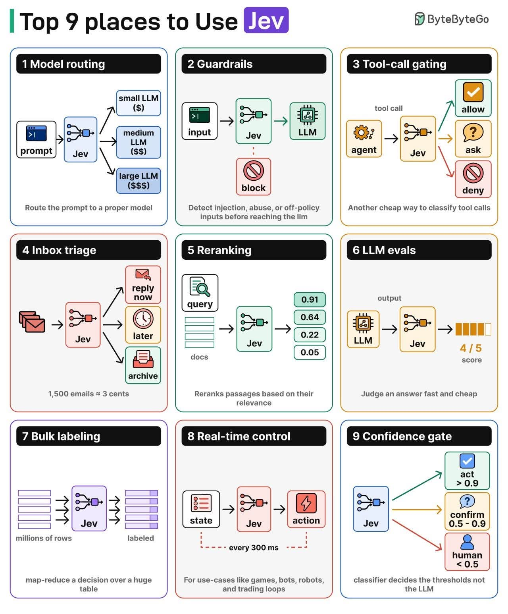

# 10 — Jev 式／TypeLLM 生態調查：誰的肩膀可以站、誰的頭上已經站著（2026-09-26）

Jev 於 2026-09-15 發表後兩週內，開源社群長出三十幾個替代品。這份筆記只留下對 jevlike 有直接參考價值的，分四類：
零樣本讀 logit（我們這一派）、LoRA + 決策頭（要訓練）、小型非自迴歸模型、校準與門檻工具。所有數字都是各專案自報，
JevBench 只有「534 公開 + 308 密封」的官方跑分可以排名，231 題公開子集的自跑分不能。

## 1. 同一派：零樣本讀選項 logit

| 專案 | 模型 / 後端 | 做法上的差異 | 自報數字 | 對 jevlike 的價值 |
|---|---|---|---|---|
| **Cygnet**（blockbrain-ai/cygnet-recipe） | 凍結 **Gemma-4-12B-it**，vLLM 0.30 | 一個答題位置、`structured_outputs.choice` 把 logit 遮成只剩字母、top-20 logprob 把「所有 decode 成同一字母的 token」機率加總、**一個溫度 T=3.4**（241 筆自產題上用 NLL 擬合） | JevBench 官方 **#4（61.8）**，公開集 87.9%、密封集 33.8%；L40S 上 p50 50–66 ms | 與我們最像的公開實作，而且是 Gemma 4。證明「凍結 Gemma 4 + 單 token 讀字母 + 一個溫度」在公開評測站得住。差別：他們 12B dense，我們 26B-A4B MoE；他們合併同字母的多個 token，我們取 max |
| **open-alternative-jev**（ikermoel） | Qwen 2.5/3.5/3.6，HF 與 vLLM | **packed readout**：state 一次，後面接 N 個問題回合，答案位置放占位符 `_<\|im_end\|>`，**一次前向讀 N 個位置的 logit**；溫度校準；`permutations=2`（正反序平均） | 自建 400 題：Qwen3.6-27B 73.7% / ECE 0.020 / 582 ms，同題 Jev 72.7% / ECE 0.144；packed 比逐題快 2.7 倍，但答案在 6–9% 的題上受鄰題影響 | packed readout 是我們 L4「共用 state 問 K 題」的另一條路：K 題一個前向而不是 K 個。要付的代價是鄰題干擾，他們量到 6–9%，剛好落在我們順序敏感度的量級 |
| **SemIf**（MIT 研究專案） | Qwen3.5-0.6B–4B | 題目與選項排成一個 JSON 物件、字母標籤、最後位置讀 logit；state 預填一次後平行分支 | JevBench #11；RTX 3090 上 21 個 criteria 1.02 s vs JSON 生成 5.33 s；反序 102 題翻 10 題 | 明說「不校準」。他們的反序翻面率（~10%）與我們的 19–21% 同一現象，這是這一派的通病，不是我們的資料問題 |
| **openjev-sglang**（ekzhang） | Qwen3.6-35B-A3B NVFP4，SGLang 0.5.19，Modal B200 | 先暖共用前綴（`max_new_tokens=1` 丟掉輸出），再平行送各題；`token_ids_logprob`；標籤 A–Z 之後接 AA、AB…啟動時驗證 64 個；信心 = 1 − H/log K | 未報 JevBench 分 | 我們 v4 的「先暖一題再整批」與他們一樣；他們遇到 SGLang「混合 logprob batch 會崩」的坑用暖機請求繞過。標籤擴充到兩字母的做法可抄，若之後有 >10 選項的題 |
| **verdict**（khimaros） | 任何 llama-server（Qwen、MiniCPM、Granite） | 自動從模型 chat template 用哨兵訊息 diff 出前後綴（30–50 s，SHA256 快取）；**option mass** = 字母在未正規化前拿到的總機率，當健康訊號；標籤可擴到 52 個 ASCII 加詞彙 token | 2.5B 一題 374 ms | option mass 是好指標：我們的 missing/top-40 檢查只看「字母有沒有在名單裡」，沒看「字母總共拿到多少機率」。值得加進 `read_option_probs` 回傳 |
| **GemmaJev**（dashidhy） | Gemma 4 E4B / 12B，llama.cpp，含 mmproj（圖、聲音） | 統一模板「Your response must begin immediately with one valid option label」；不校準 | 13 個資料集 9,176 題：BoolQ 89.5%（Jev 對照組同級）、MMLU 73% vs Jev 93.5% | 已把 Gemma 4 的 mmproj 接上 llama.cpp，是我們若要做「看圖判斷」的現成起點 |
| **gemma-jev**（catonooka） | Gemma 4 E4B / 26B-A4B，llama.cpp | 見 06-comparison | 3090 上 26B 48 ms | 已比過 |
| **NON906/llama.cpp-Jev** | llama-server C++ 補丁 | 直接在 llama-server 加 `/v1/systemone`，支援圖與聲音；作者自註「機率不準、未量測」 | — | 只看方向：Jev wire format 直接長在 llama-server 裡，GB10 若要對外提供 Jev 相容 API 可參考 |

## 2. 要訓練的：LoRA + 決策頭

| 專案 | 底模 | 訓練 | 自報數字 | 對 jevlike 的價值 |
|---|---|---|---|---|
| **decider-4b v2**（Mapika） | Qwen3.5-4B-Base | 一輪 SFT + 8,000 筆 LoRA，資料是**對著密封集公布的十個題族名稱**程式生成 | JevBench **#1（64.1）**；hard 0.550 → 0.676、hard ECE 0.288 → 0.071 | 4B 訓練後贏 Jev。訊息：題族對了，8,000 筆就夠 |
| **JevK5**（alibiserikbay） | Qwen3.5-4B | 從「開思考的 Qwen3.6-27B」蒸餾 3,272 筆 + 3,272 筆人標，LoRA r16 attention，T=1.53 | #3（62.0）；hard 0.613 → 0.739（McNemar p=0.013） | **正是我們 3c 級聯的訓練版**：讓大模型開思考出題標答，教小模型一次讀出。我們有 26B、有 E4B、有合成產線題，材料齊全 |
| **Open-Jev-27B v1.1**（Zefan Cai） | Qwen3.8-27B | LoRA r8 + 標量決策頭，148,639 筆（51k 規則化反事實 + 82k WANLI + 35k 重播），NLL + Brier，溫度另擬 | 公開集 85.3%、hard 72.1%（Jev 86.6 / 73.0） | 教訓：「結構化反事實」比堆量有效；prefix cache 在 H100 上 11 次超出機率誤差門檻後預設關閉（與我們 v6 的翻面同源） |
| **Kev-9B**（jaredpalmer） | Qwen3.5-9B-Base | LoRA r16 + pointer head，93,798 筆公開 + 合成題族，軟標籤（標註者分歧 p≥0.6 保留），溫度在**別的資料集**上擬合 | OOD 0.852（Jev 0.857）；Modal 花費約 $2,500 | 兩個可抄的細節：軟標籤勝硬標籤、溫度不能在訓練同分布上擬合。失敗案例：全參數 SFT 讓「冷靜的投訴被讀成生氣」 |
| **imajev**（2B/4B/9B） | Qwen3.5 + 圖 | 約 100 萬筆（504k 人標），LoRA r16/α32，線性讀出，回傳 `unknown_probability` 與 `abstained` | 4B 公開集 easy 1.00、hard 0.703 | 「不知道」當一個原生輸出欄位，比我們的 noul 選項更乾淨 |
| **Clef / Clef-flash**（Cloudflare，2026-10-01，Apache 2.0） | Qwen3.8-27B／Qwen3.5-9B（dense，混合 linear attention） | rank-256 LoRA 已併入權重 + joint schema head（讀每個位置 hidden state 做 cross-attention，一次 prefill 對全部題的全部選項打分）；label-smoothed CE + Brier，再 RLCD；合成資料打亂欄位、prompt、schema | BANKING77 94.2、CLINC150 97.4（27B；flash 66.8）；flash 自家 edge p50 38.8 ms | **v10 自跑同尺對照**（`15-clef.md`）：27B D0 96.6%（我們 95.5%）、SPC +11 點、重排序 0.879 過門檻、三題一起不掉；flash 93.0%。但只能 transformers BF16 跑（判斷頭接不上推論引擎、量化版不等價），本機單題不比我們快 |
| **system-one-open**（mithalouni） | Gemma 4 E2B LoRA | Modal 訓練與服務 | #14（45.1） | 同底模的下界：E2B 訓練後仍只 45 分，與我們 v3「四類簡單題 E2B 夠、六類不夠」一致 |

## 3. 小型非自迴歸

Laya（421M ModernBERT，RLCD 校準）、von（<15 ms）、poorjev 的 NLI 模型：一個前向同時對所有選項打分。我們 v2 量到 Laya 零樣本在產線題接近亂猜，這一類要有標註資料才成立；CPU 上跑得動是它們唯一勝過我們的地方。

## 4. 校準與門檻工具（沒有模型，只有方法）

| 工具 | 做什麼 | 對 jevlike 的價值 |
|---|---|---|
| **poorjev** | 溫度（5-fold CV）+ **conformal 門檻**：給定錯誤預算（例如 10%），自動算出「低於多少信心就升級」，在 held-out 上保證錯誤率不超預算 | 我們 Q6 用的是「sel@0.9 / 0.95 的準確率與 coverage」，是描述不是保證。conformal 把它反過來：先定可接受錯誤率，再得門檻與 coverage，這是長官會問的形狀 |
| **jevcal** | 每題一個門檻，一半資料擬合、另一半驗證，寫 lock 檔；估算多少流量要 fallback；CI 裡重測，掉了就失敗；信心量測可選 top_prob / margin / entropy / auto | 我們的門檻是分析報告裡的數字，沒有 lock 檔與 CI 重測。真實資料上線時要有這個 |
| **jevkit** | 政策層：typed 機率進、可稽核的動作出；預算編譯門檻、置換與漂移檢查 | 把「決策 API」和「行動」分開的框架，之後接派工系統時參考 |
| **AnthusAI/Jev-Calibration**、**does-jev-confidence-mean-anything** | 用 Platt / isotonic 校準 Jev；8,000 筆對人標的稽核 | Jev 自己的校準也被獨立稽核過，數字並不完美（open-alternative-jev 量到 ECE 0.144） |

## 5. 站在誰的肩上：可以直接拿來用的（依價值排序）

1. **packed readout**（open-alternative-jev）：K 題一個前向，比我們現在的「同 slot 順序送 K 次」少 K−1 次 decode。在 llama-server 上要能取多個位置的 logprob：`/completion` 的 `n_probs` 只給生成位置，但 `prompt` logprobs 可以用 `--logits-all` 或 SGLang 的 `logprob_start_len` 拿到。要付的是 6–9% 的鄰題干擾，我們的順序敏感度已知 19–21%，兩者可能疊加，**要量**。
2. **option mass**（verdict）：字母未正規化前拿到的總機率。低 option mass 代表模型其實不想答字母（模板錯、`<bos>` 少了都會反映在這裡）。v6 的 `<bos>` 問題若當初有這個指標，smoke 就會看到。十行程式。
3. **conformal 門檻**（poorjev）+ **lock 檔與 CI 重測**（jevcal）：把 Q6 從「報告數字」變成「上線機制」。不用 GPU，用現有 logprobs 就能做。
4. **同字母多 token 加總**（Cygnet）：Gemma 4 詞表裡 `A`、` A`、`Ａ` 都會 decode 成 A。我們取 max，他們取 sum。差異在 1e-3 以下，但 sum 在理論上對。
5. **標籤擴充到 AA、AB**（openjev-sglang）：現在 `LETTERS = "ABCDEFGHIJ"` 上限 10，`x_10way_intent` 剛好卡住。
6. **溫度在別的分布上擬合**（Kev、Open-Jev）：我們的溫度在同 task 的 cal 半上擬合，真實資料上要改成跨 task 或跨來源擬合，否則過擬合。
7. **JSON 形狀的 state**（Cygnet 用 `json.dumps(indent=1)`）：我們的 state 是自然語言段落。產線資料本來就是結構化的（機台、站別、數值），JSON 形狀可能比散文穩，值得一個 smoke。

## 6. 站在誰的頭上：我們已經有、別人沒有的

1. **Gemma 4 26B-A4B 的正確模板**：TypeLLM 明說不支援；SemIf、open-alternative-jev、verdict 都綁 ChatML。Gemma 4 這一派只有 Cygnet（12B dense）、GemmaJev、gemma-jev 和我們。
2. **`<bos>` 這一個 token 值 2–3 分**：沒看到任何專案寫到。用 HF tokenizer 的引擎（vLLM、SGLang、TypeLLM）接 Gemma 4 都可能踩到；Cygnet 在 vLLM 上 87.9%，不知道有沒有加。
3. **題目簡單還是模型強**的階梯實驗（v3）：別人只報一個分數，沒有拆「哪些題 2B 就夠」。
4. **選項順序敏感度分 task 量**（v5）：SemIf 報了 10 翻，open-alternative-jev 報 6–9%，都是整體數；我們知道它集中在相鄰等級的兩題。
5. **held-out 種子驗證改寫 criteria**（v2 §05）、**獨立抽查**、**pre-registered 門檻**：這一派的自報數字幾乎都沒有這些。
6. **SGLang 對 llama-server 的同題對照**（v4/v6）：其他人各用一個後端，沒有人量兩個後端在同一題上的差。

## 7. 這一輪不建議追的

- **自己訓練 LoRA**：decider / JevK5 / Kev 證明 4B 訓練後能贏 Jev，但他們的題族是 JevBench 的形狀。我們真實資料還沒到手，訓練沒有目標分布；等 200–500 筆真實工單後，JevK5 的蒸餾配方（26B 開思考出題標答 → E4B LoRA）是第一選擇，估 Modal 幾十美元。
- **跑 JevBench 公開集**：英文、通用題，與產線題無關；只為了拿一個可比的分數，值一次 L4 半小時，但分數不會改變任何決策。放低優先。
- **Laya 一類小模型**：v2 已量過零樣本不行。

## 8. ByteByteGo「Top 9 Places to Use Jev」逐格對照我們的實測

來源：ByteByteGo 電子報 EP227（2026-09-26），<https://blog.bytebytego.com/p/ep227-top-9-places-to-use-jev>。結語："use the LLM for generations and use Jev on the decisions around it."
圖為 ByteByteGo 原圖，僅供對照引用，版權屬 ByteByteGo。

| # | 圖上的場景 | 我們測過嗎 | 我們的數字（合成產線題，除非另註） | 判讀 |
|---|---|---|---|---|
| 1 | Model routing：prompt 分給小／中／大模型 | **測過（v3 級聯）** | E4B 先答、把握 < 0.999 才問 26B：acc 0.952 vs 全 26B 0.955；34% 送 26B；期望延遲 137 → 110 ms（L4） | 成立。路由判斷本身用最小的模型自己的把握度就夠，不必另訓分類器 |
| 2 | Guardrails：注入、濫用、違反政策 | **測過（v9）** | 誤擋定 5% 時攻擊 recall 96.4%（26B）；E4B 48%、E2B 39%；Gemini 盲寫外部題 74.5%，錯的全是「可以 bypass 嗎」這種正常詢問被擋 | 成立，只能放 26B；錯在過度擋下 |
| 3 | Tool-call gating：allow／ask／deny | **測過（v9），未過** | 90.0%（門檻 95%）；危險放行 0；錯的全是「該拒絕判成詢問」：參數超規格 7/7、全產線範圍 7/7 | 數字與範圍交給程式規則，模型只處理規則表以外的呼叫 |
| 4 | Inbox triage：reply now／later／archive；圖註 1,500 封 ≈ 3 美分 | **測過** | `x_ticket_route` 1.00、`m_alarm_severity`（不急／盡快／停線）0.82 → 改寫標準 0.885。成本：L4 逐題 137 ms → 1,500 則約 $0.05；SGLang L40S 整批 92.8 則/秒 → 約 $0.01 | 成立，成本與圖上同量級。**相鄰等級**（now vs later）是最難的一類，要可數標準 |
| 5 | Reranking：query 對每段打相關分數 | **測過（v9），差一點** | nDCG@5 0.840（門檻 0.85），BM25 0.654；SGLang 同準、20 段 1.2 s vs llama 8.1 s | 可做，但**每段各讀一次**，不要一次塞全部；SGLang 暖前綴後整批送就夠快 |
| 6 | LLM evals：回 4/5 這種分數 | **測過（v9）** | 600 個回答 5 等級：26B 完全對 99.7%、危險答案被打高分 0%；E4B ±1 內 100%；生成 JSON 打分同準但慢 1.5 倍 | 成立。回傳完整機率向量，期望分數比 argmax 更好用 |
| 7 | Bulk labeling：百萬列 map-reduce | **測過批次速度** | SGLang L40S D0 1,001 題 10.8 s（92.8 則/秒），llama-server 67 s；補 `<bos>` 後兩者同準 | 成立。批次正是 SGLang 的主場，比 llama-server 快 6 倍 |
| 8 | Real-time control：每 300 ms 一次 | **測過延遲** | 單題 p50 L4 137 ms、L40S 61 ms；背景生成時 p95 退化 1.31–1.38×；但數字推算最弱：UPH 0.93、JevBench temporal_numeric 27% | 延遲預算夠。**「讀數字做判斷」不要交給它**，數值先用公式算好再給模型 |
| 9 | Confidence gate：> 0.9 自動、0.5–0.9 確認、< 0.5 轉人；「門檻由分類器決定，不是 LLM」 | **測過，而且這一格要改** | raw 信心平均 0.99；急迫度在 > 0.9 時 coverage 0.97 但只對 0.835，SPC 0.99 / 0.869。改用選擇性風險控制（先定錯誤預算 5%）：強題自動處理 98–100%、實際錯 0–2%，10/10 類守住；做不到的急迫度完全不自動 | 方向對、數字錯。**0.9 / 0.5 不能當固定門檻**：未校準的開源模型幾乎都 > 0.9；Jev 自己的 ECE 也被量到 0.144。門檻要用自己的標註資料反推並鎖檔重測（`bench/thresholds.py`、`verify.py --check-lock`） |

**v10 補充（Clef 同尺對照）**：Clef 27B 把第 5 格重排序翻成過（nDCG@5 0.879），第 2 格護欄的外部題從 74.5% 拉到 98.2%；第 3 格工具守門更差（85%，危險放行 2.7%）。代價是只能 transformers BF16、本機沒有速度優勢（見 `15-clef.md`）。

**一句話（v9 補測後）**：九格全部實測過。成立七格（1、2、4、6、7、8、9）；沒過兩格：工具守門輸在數字比規格與影響範圍（交給程式規則），重排序差門檻 0.01。要改的仍是兩處：第 9 格的固定門檻換成用資料反推的，第 5 格逐段讀、不要打包。第 9 格的「反推」在 v9 修正過方法（見 `14-nine-places.md`）。

## 9. 2026-10-06 補調查：Gemma 4 這條線十天內的新東西（v12 的來源）

| 名稱 | 底模 | 做法 | 成績 | v12 怎麼處理 |
|---|---|---|---|---|
| Cygnet（更新） | 凍結 Gemma 4 12B | 零訓練讀字母；所有解碼成同一字母的 token 機率相加；score 題回機率加權等級；T=3.4 | JevBench v1.5.4 官方第 1（73.70） | E1 借「機率加權等級」：持平；E3 補 12B |
| Winnow-12B | Gemma 4 12B | LoRA r32 合併，讀答案 token logit，有 GGUF 與自帶 server | 73.23，與第一並列 | 未測：英文通用訓練，v11 jevify 的教訓 |
| Jev-Omni | Gemma 4 12B | 加分類頭，3 萬題，支援圖、聲音、影片 | 71.50 | 未測：只有 transformers |
| Surogate Rune 26B-A4B v3 | **Gemma 4 26B-A4B** | 微調；信心 < 0.7 才思考 ≤ 512 token（約一成觸發，Decision Index +1.5） | 66.47 | E4 借「低信心才思考」：持平 |
| decisio 0.6.0 | 凍結 Gemma 4 31B | 零訓練讀字母；choice 與其他題型各一個溫度 | Decision Index 57.58（凍結 12B 49.43） | E2 借「題型溫度」：維持每類；E3 補 31B |
| llama.cpp `/v1/systemone`（PR #29818） | — | 只支援 Laya、Julia-1、Lev、OpenJev 27B、Kev | — | 一般 Gemma 不能用，維持自己的 client |
| DiffusionGemma 26B | Gemma 4 擴散版 | 外部實測落在合法答案上的機率只有 37–59% | — | 不能用讀 logit 的方式 |
| JevOut（arXiv 2609.30243） | — | 刻意優化的自然語境翻掉 Jev 61% 的決策，翻錯的近半信心 ≥ 0.7；中性一句只翻 2.2% | — | 記為風險：吃外部文字的題要注意 |

另一個獨立對照：純 Gemma 4 26B 在 Bespoke Labs 3,880 題上 75.3%，Jev 77.3%（L4、vLLM、AWQ 4-bit），是非題打平、選擇題落後 4.5 點，與我們的結論一致。
來源：JevBench <https://benchlm.ai/benchmarks/jevbench>、Cygnet <https://github.com/blockbrain-ai/cygnet-recipe>、Winnow <https://huggingface.co/EldanRing/Winnow-12B>、Jev-Omni <https://jev-ai.pro/model/jev-omni>、Rune <https://huggingface.co/michaelfeil/rune-26b-a4b>、decisio <https://github.com/apolinario/decision-index/pull/62>、llama.cpp <https://huggingface.co/blog/ggml-org/decision-models-in-llamacpp>、JevOut <https://arxiv.org/abs/2609.30243>、L4 對照 <https://dev.to/gde/plain-gemma-4-26b-vs-jev-on-one-ec2-l4-21-points-behind-overall-level-on-yesno-45-behind-on-15k6>

## 來源

Cygnet <https://github.com/blockbrain-ai/cygnet-recipe>、open-alternative-jev <https://github.com/ikermoel/open-alternative-jev>、SemIf <https://tomrochette.com/agents/hybrid-execution/semif/>、openjev-sglang <https://github.com/ekzhang/openjev-sglang>、verdict <https://github.com/khimaros/verdict>、GemmaJev <https://github.com/dashidhy/GemmaJev>、llama.cpp-Jev <https://github.com/NON906/llama.cpp-Jev>、decider <https://github.com/Mapika/decider>、JevK5 <https://github.com/fstandhartinger/jevbench/issues/31>、Open-Jev <https://zefan-cai.github.io/open-jev/story/>、Kev <https://github.com/jaredpalmer/kev/blob/main/PLAN.md>、imajev <https://github.com/fstandhartinger/jevbench/issues/80>、system-one-open <https://github.com/mithalouni/system-one-open>、poorjev <https://github.com/rupeshpoojary9/poorjev>、jevcal <https://github.com/abhixhek/jevcal>、jevkit <https://github.com/JasmineAIGC/jevkit>、awesome-open-system-one <https://github.com/rupeshpoojary9/awesome-open-system-one>、JevBench <https://github.com/fstandhartinger/jevbench>、Clef <https://blog.cloudflare.com/clef-decision-models/>、<https://huggingface.co/Cloudflare/clef>、榜 <https://benchmarkheaven.com/jev-models>、TypeSafe 原文 <https://typesafe.ai/blog/introducing-system-one-models-and-jev>。
